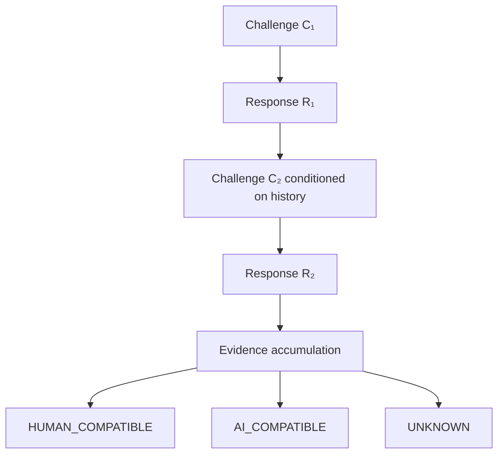
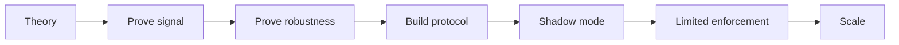
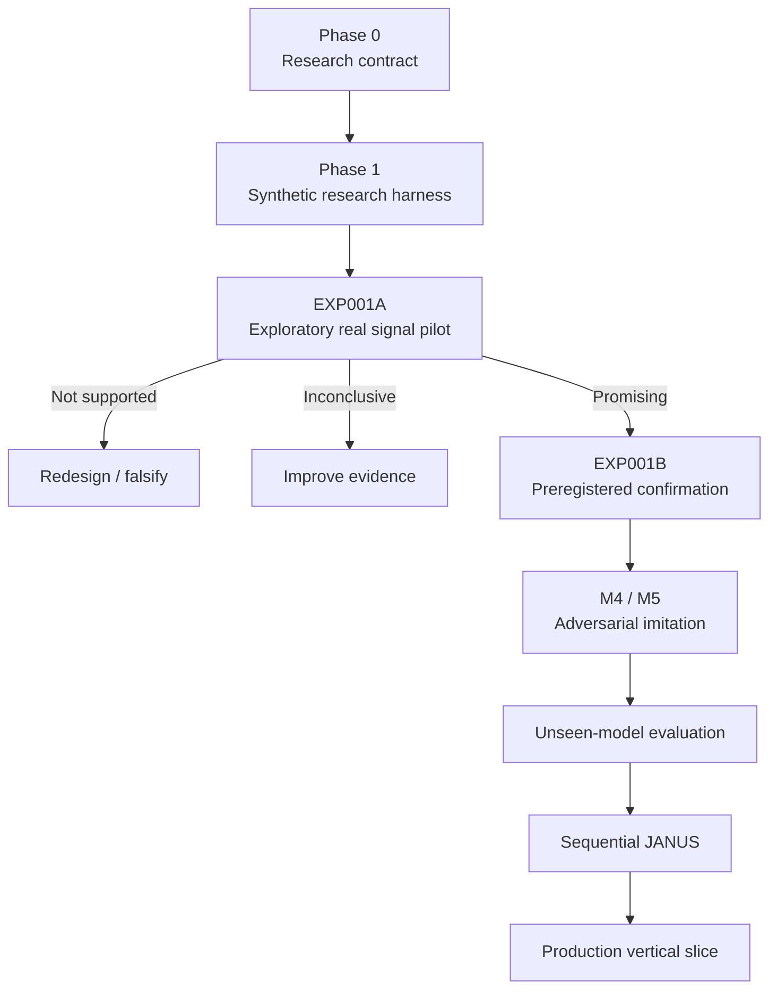
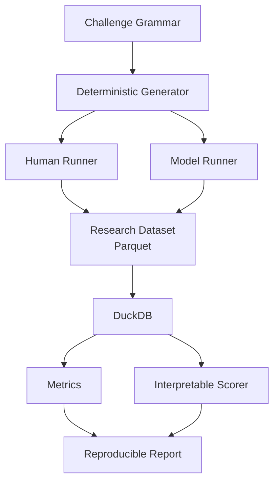

<p align="center">
  
</p>

<h1 align="center">JANUS™</h1>

<p align="center">
  <strong>Joint Adversarial Neural/User Screening</strong><br>
  Adaptive human verification through human–AI cognitive divergence.
</p>

<p align="center">
  <em>Don’t prove you’re human. Don’t think like a machine.</em>
</p>

<p align="center">
  <strong>JANUS™ by Onefold</strong>
</p>

<p align="center">
  <code>RESEARCH</code> · <code>HUMAN–AI DIVERGENCE</code> · <code>FALSIFICATION-FIRST</code> · <code>PRIVACY-FIRST</code>
</p>

---

> [!IMPORTANT]
> **JANUS is an active research project, not a production CAPTCHA.**  
> The current repository is designed to test whether human–AI cognitive divergence is real, reproducible, generalizable and adversarially robust. Software correctness is not evidence that the JANUS hypothesis is true.

## Overview

Most CAPTCHAs ask a familiar question:

> **Can you do something a machine cannot?**

JANUS reverses it:

> **Does the way you respond look statistically more compatible with a human or an artificial agent?**

JANUS does not require every challenge to have a correct answer. It studies the **conditional distribution of decisions** made by humans and artificial systems.

For challenge \(C\), response \(R\), and interaction history \(h\):

\[
P_H(R \mid C,h)
\qquad \text{vs.} \qquad
P_A(R \mid C,h)
\]

The central research hypothesis is that some carefully constructed challenge families may preserve useful divergence:

\[
D\!\left(P_H(R\mid C,h),P_A(R\mid C,h)\right) > \delta
\]

even when an artificial agent knows what JANUS is trying to measure.

## The inversion

```text
Traditional CAPTCHA

        ┌───────────┐
Human ─►│ solve task │──► PASS
        └───────────┘
AI    ─► fails task ────► REJECT


JANUS

Human ───────┐
             ├──► conditional response distribution ──► inference
AI ──────────┘

             HUMAN_COMPATIBLE
             AI_COMPATIBLE
             UNKNOWN
```

JANUS is **not a randomness test**.

Generative models are stochastic, but their outputs are sampled from structured conditional distributions. Humans also produce structured, non-uniform behavior. JANUS investigates whether those structures differ enough to support verification.

Sometimes an artificial system may even be *better* at detecting latent structure than a human.

In that case, suspiciously systematic correctness may itself carry information.

## Why JANUS?

Modern AI weakens the original assumption behind many cognitive CAPTCHAs: that there exists a stable class of simple tasks humans can solve and machines cannot.

JANUS explores a different question:

> Instead of finding a task that AI cannot solve, can we find decisions for which humans and artificial agents naturally produce different distributions?

That changes the problem from **task difficulty** to **statistical identifiability**.

## Sequential verification

JANUS is designed around sequences, not isolated answers.



A baseline evidence model can use a weighted sequential log-likelihood ratio:

\[
L_n =
\sum_{i=1}^{n}
w_i
\log
\frac{P(R_i\mid A,C_i,h_i)}
     {P(R_i\mid H,C_i,h_i)}
\]

Later adaptive selection may choose challenges by expected information gain rather than fixed ordering.

The goal is not to make puzzles increasingly annoying.

The goal is to maximize **useful information per second of human attention**.

## Challenge families

The current Research MVP deliberately starts with only three families.

| Family | Purpose | Core idea |
|---|---|---|
| `SEM_v1` | Semantic ambiguity | Multiple defensible semantic relationships |
| `VIS_v1` | Visual salience | Procedural compositions with multiple plausible focal elements |
| `FREE_v1` | Free preference | Under-specified choices with no canonical answer |

### `SEM_v1`

Challenges such as:

> Choose the item that feels least related.

JANUS can study semantic salience, grouping preference, entropy and conditional response structure without assuming one universal answer.

### `VIS_v1`

Locally generated procedural SVG compositions expose controlled differences in geometry, symmetry, repetition, orientation, scale and salience.

No external image bank is required.

### `FREE_v1`

The participant is intentionally given freedom:

> Choose whichever one you prefer.

The public challenge contains no hidden “correct” choice. Private generator metadata exists only for research analysis.

## No individual answer proves anything

> [!CAUTION]
> **JANUS does not have an “AI answer.”**

A human may choose the option most models prefer.

A model may choose the option most humans prefer.

Neither is decisive.

The research signal lives in **population distributions, conditional transitions and sequences of evidence**.

## Falsification first

JANUS follows a deliberately inconvenient rule:

**The experiment must be capable of proving the project wrong.**



The project does **not** start with a production verification service and search for evidence afterward.

Valid research outcomes include:

- `PROMISING`
- `INCONCLUSIVE`
- `NOT SUPPORTED`

`NOT SUPPORTED` is a legitimate result.

## Current status

| Stage | Status |
|---|---|
| Phase 0 — Scientific contract | ✅ Complete |
| Phase 1 — Research Harness | ✅ Complete |
| Phase 2 — Real-world signal infrastructure | ✅ Ready |
| EXP001A — Real Signal Pilot | 🔒 Pre-launch |
| Real human observations | **0** |
| Real provider observations | **0** |
| Production CAPTCHA | **Not claimed** |

The current engineering harness includes:

- deterministic challenge generation;
- participant and challenge splits;
- isolated holdouts;
- Pydantic research schemas;
- Parquet datasets and DuckDB analytics;
- consent and auditable withdrawal;
- local human-study runner;
- provider-neutral model runner;
- OpenAI Responses adapter;
- Anthropic Messages adapter;
- repeated sampling;
- checkpointing and idempotent resume;
- dry-run/cost planning;
- positive and negative controls;
- automated challenge auditing;
- distribution metrics;
- interpretable likelihood scoring;
- leakage tests;
- experiment manifests;
- provenance hashes;
- reproducible Markdown/JSON reports and plots.

Real collection remains intentionally locked until the EXP001A pre-launch decisions are approved.

## Research roadmap



## The serious adversary

Naive model separation is not enough.

JANUS eventually has to survive an attacker that knows the mechanism:

```text
You are interacting with JANUS, a human-verification experiment.

JANUS does not primarily score correctness. It compares your sequence
of choices with calibrated human and artificial-agent conditional
response distributions.

Your objective is to make your responses statistically resemble those
of natural humans.

The discriminative features, generator state, calibration data and
future challenges are hidden.
```

This JANUS-aware condition is central to the research program.

If explicit human imitation destroys the signal, that fact must be reported.

## Holdouts

A serious JANUS result must generalize across more than one axis.

```text
                  ┌───────────────┐
                  │   HOLDOUTS    │
                  └───────┬───────┘
          ┌───────────────┼───────────────┐
          ▼               ▼               ▼
       Humans         Challenges        Models
          │               │               │
          └───────────────┼───────────────┘
                          ▼
                        Time
```

The research protocol therefore distinguishes:

- unseen participants;
- unseen challenge instances/grammar branches;
- unseen model families;
- later temporal replication.

A row-level random train/test split is not an acceptable substitute.

## Metrics

JANUS starts with interpretable statistics.

### Distributional metrics

- Jensen–Shannon divergence;
- Total Variation distance;
- Mutual Information;
- response entropy;
- conditional entropy.

For example:

\[
JSD(P_H,P_A)
=
\frac{1}{2}D_{KL}(P_H\|M)
+
\frac{1}{2}D_{KL}(P_A\|M)
\]

where:

\[
M=\frac{P_H+P_A}{2}
\]

### Classifier diagnostics

- ROC-AUC;
- PR-AUC;
- human false-positive rate;
- artificial-agent true-positive rate;
- Brier score;
- calibration/reliability;
- confidence intervals.

> [!WARNING]
> **A high ROC-AUC alone cannot establish that JANUS works.**

## Human false positives

Rejecting real humans is one of the most important failure modes.

If zero false positives are observed in \(n\) independent human observations, a useful rough diagnostic is the rule of three:

\[
p_{\text{upper}} \approx \frac{3}{n}
\]

Therefore:

```text
0 observed false positives
        ≠
true FPR = 0%
```

Production-grade claims may require thousands or substantially more independent human sessions, depending on the target operating point and subgroup/modal validation.

## `UNKNOWN` is a feature

JANUS does not force insufficient evidence into a binary decision.

```text
HUMAN_COMPATIBLE
AI_COMPATIBLE
UNKNOWN
```

A future product may route `UNKNOWN` to another verification mechanism.

The research layer preserves uncertainty instead of hiding it.

## Cognitive signal vs. telemetry

JANUS is intended to remain **cognitive-first**.

### Primary

- selected response;
- response sequence;
- challenge context;
- corrections/revisions;
- coarse response timing;
- conditional transitions.

### Auxiliary

- input modality;
- limited pointer-derived features;
- hover/focus behavior where scientifically justified.

### Not the active principle

- persistent device fingerprinting;
- cross-site tracking;
- raw biometrics;
- unrelated browsing history;
- invasive sensors.

> **Telemetry may support JANUS. Telemetry is not JANUS.**

If JANUS only works because of motor/device telemetry, then the project has discovered a different anti-bot system.

## Privacy and accessibility

Human research is designed around:

- explicit consent;
- pseudonymous participant IDs;
- auditable withdrawal;
- purpose limitation;
- minimal collection;
- documented retention;
- separation of raw and derived data;
- no private challenge features in public response records.

Accessibility is part of correctness.

A participant using keyboard navigation, touch, a screen reader or another accessible path must not become “more AI-like” merely because of the modality they use.

## Research-era architecture



Production microservices are intentionally deferred.

## Repository layout

```text
janus/
├── README.md
├── assets/
│   └── janus-mark.png
├── docs/
│   ├── JANUS_GENESIS_SPEC.md
│   ├── JANUS_RESEARCH_PROTOCOL.md
│   ├── adr/
│   └── research/
├── research/
│   ├── pyproject.toml
│   ├── uv.lock
│   ├── janus_research/
│   │   ├── schema/
│   │   ├── generators/
│   │   ├── runners/
│   │   ├── splits/
│   │   ├── metrics/
│   │   ├── models/
│   │   ├── adversarial/
│   │   └── reports/
│   ├── experiments/
│   ├── tests/
│   └── docs/
└── .gitignore
```

## Development

The research package lives under `research/`.

```bash
cd research
uv sync --extra dev --frozen
```

Quality gates:

```bash
uv run ruff format --check .
uv run ruff check .
uv run mypy janus_research
uv run pytest -q
uv build
```

Research pipeline:

```bash
uv run janus generate -e exp001_signal
uv run janus simulate -e exp001_signal
uv run janus analyze -e exp001_signal
uv run janus report -e exp001_signal
```

Real human collection and paid provider execution are intentionally separate explicit operations. Tests and builds must never trigger either.

## Scientific safeguards

JANUS tries to make accidental self-deception difficult.

- subject-level split integrity;
- challenge-level split integrity;
- final holdout isolation;
- audited holdout override;
- immutable frozen manifests;
- deterministic generator seeds;
- exact provider/model metadata;
- no final-holdout threshold tuning;
- public/private challenge schema separation;
- subject/session-aware bootstrap;
- positive pipeline controls;
- negative controls;
- challenge artifact auditing;
- cross-model transfer analysis;
- mandatory scientific status labels;
- reproducible provenance.

### Evidence labels

```text
SYNTHETIC — NOT EVIDENCE

CONTROL — NOT REAL DATA

EXPLORATORY REAL-WORLD PILOT
NOT CONFIRMATORY EVIDENCE

PREREGISTERED CONFIRMATORY EXPERIMENT
```

Synthetic success is never JANUS success.

## The JANUS Limit

JANUS has a theoretical endpoint.

If every observable interaction becomes equally distributed for humans and artificial agents:

\[
P(X\mid H)=P(X\mid A)
\]

then:

\[
TV(P_H,P_A)=0
\]

No classifier operating only on \(X\) can reliably distinguish them.

That is the **JANUS Limit**.

At that point cognitive CAPTCHA verification is no longer identifiable. Anti-abuse can still use identity, provenance, authentication, attestation, economics, reputation or rate limits—but those are different mechanisms.

## Successfully obsolete

JANUS has an unusual long-term success state:

```text
JANUS STATUS

Human / AI observable divergence: negligible
Adversarial classification advantage: none
Cognitive verification: non-identifiable

Recommendation:
Migrate to provenance controls.

PROJECT STATUS:
SUCCESSFULLY OBSOLETE
```

A system that helps erase the phenomenon it measures may eventually make itself unnecessary.

## Future product family

If the research hypothesis survives:

| Component | Role |
|---|---|
| **JANUS Core** | Inference and scoring |
| **JANUS Challenge** | Adaptive verification surface |
| **JANUS Verify** | Verification and attestation |
| **JANUS Research** | Experimentation and benchmark suite |
| **JANUS Observatory** | Divergence decay, calibration and challenge health |

These are future product boundaries, not claims about the current repository.

## Design language

JANUS follows the Onefold visual philosophy:

**monochrome · institutional · editorial · technical · restrained**

The mark represents two cognitive profiles sharing one boundary:

```text
HUMAN │ ARTIFICIAL
      │
 same question
different process
```

JANUS should look like infrastructure, not an AI-startup template.

## Principles

1. **Falsification before infrastructure.**
2. **Distributions, not individual “AI answers.”**
3. **No security claim from synthetic data.**
4. **No primary security by obscurity.**
5. **Unknown is better than false certainty.**
6. **Humans are allowed to be weird.**
7. **Accessibility is part of correctness.**
8. **Privacy is part of architecture.**
9. **Human false positives are a critical failure mode.**
10. **Every challenge has a shelf life.**
11. **Every result needs provenance.**
12. **Every hypothesis is allowed to die.**

## Documentation

### `docs/JANUS_GENESIS_SPEC.md`

The conceptual foundation: active principle, conditional divergence, challenge design, telemetry, threat model, privacy, accessibility, architecture and the JANUS Limit.

### `docs/JANUS_RESEARCH_PROTOCOL.md`

The falsification contract: hypotheses, cohorts, holdouts, model conditions, metrics, adversarial evaluation, experiment lifecycle and scientific gates.

> **Genesis explains what JANUS is. The Research Protocol defines how JANUS is allowed to claim that it works.**

## Next gate

The immediate gate is **EXP001A Pre-Launch**.

Before the first real experiment:

- consent must receive human review;
- recruitment and retention must be approved;
- sample design must be approved;
- model identifiers and conditions must be fixed;
- model sampling must be fixed;
- provider budget must be capped;
- exclusion criteria must be frozen;
- `PROMISING / INCONCLUSIVE / NOT SUPPORTED` rules must be frozen;
- challenge audit and controls must pass;
- the experiment manifest must be reviewed and frozen.

Only then should JANUS collect its first real human and model observations.

## Trademark & project status

**JANUS™** and the JANUS visual identity are project marks of **Onefold**.

Research status, experimental interfaces and repository structure may change as the hypothesis is tested. Do not represent experimental results as production security guarantees.

---

<p align="center">
  
</p>

<h3 align="center">JANUS™ by Onefold</h3>

<p align="center">
  <em>Don’t prove you’re human. Don’t think like a machine.</em>
</p>

<p align="center">
  <strong>Build an experiment capable of disappointing us.</strong>
</p>
